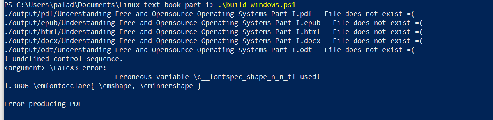

# Linux-text-book-part-1

This is the outline and of intermediate content for Linux Technology and Philosophy based on LPIC II

How to install;

1. You can just open the markdown (.md) in Visual Studio Code Editor (great free editor with Markdown preview support built in and it is cross platform Windows, Mac and Linux!) [Here is the link](https://code.visualstudio.com/)

2. Use Pandoc to build your output (This README assumes you are using Linux, but these instructions can be adapted to build on Mac and Windows since pandoc has multiple distributions

[Install Instructions](http://pandoc.org/installing.html)

## Ubuntu Linux

I would recommend installing Pandoc directly from the latest Debian package.  Located here: [Pandoc Release Page for Pandoc 2.2.2-x](https://github.com/jgm/pandoc/releases/download/2.2.2.1/pandoc-2.2.2.1-1-amd64.deb "Pandoc Latest deb package").   You will need to issue a ```dpkg``` command to install the deb package directly.  ```sudo dpkg -i pandoc-2.2.2.1-1-amd64.deb```

### Linux dependencies - On Debian/Ubuntu

* texlive
* texlive-latex-recommended
* texlive-latex-extra
* texlive-fonts-recommended
* texlive-fonts-extra
* texlive-font-utils
* texlive-xetex
* librsvg2-bin
* Install these via this command:
  * ```sudo apt-get install texlive texlive-latex-recommended texlive-latex-extra texlive-fonts-recommended texlive-fonts-extra texlive-xetex texlive-font-utils librsvg2-bin```

Additional Fonts are needed.  To add the [Charis Sil font](http://packages.sil.org/ "Charis SIL") to Ubuntu 16.04 can add the repo via these steps:

* ```wget http://packages.sil.org/sil.gpg```
* ```sudo apt-key add sil.gpg```
* ```sudo apt-add-repository "deb http://packages.sil.org/ubuntu/ $(lsb_release -sc) main"```
* ```sudo apt-get update```
* ```sudo apt-get install fonts-sil-charis```

To Install the Inconsolata font:

* ```sudo apt-get install fonts-inconsolata```
* ```sudo fc-cache -fv```

To confirm install from the command line type: ```pandoc -v```

### Linux Dependencies - On Fedora 30 & 31

This is for installing Pandoc 2.X branch.  You will need to download the Pandoc binary from [pandoc.org](https://github.com/jgm/pandoc/releases/ "Pandoc GitHub release tab"), do not install via dnf or yum as those versions are out of date.  Extract the tarball (tar.gz) and copy the contents of ```./pandoc-2.2.2-1/bin/```  to ```/usr/local/bin```.  You will need to use sudo because ```/usr/local/bin/``` is owned by root.

* texlive
* texlive-latex-fonts
* texlive-xetex
* texlive-inconsolata-doc
* levien-inconsolata-fonts
* texlive-inconsolata
* texlive-nfssext-cfr.noarch
* texlive-plnfss.noarch
* texlive-psnfss.noarch
* texlive-nfssext-cfr
* sil-charis-compact-fonts
* sil-charis-fonts
* texlive-texliveonfly
* texlive-pdftex
* librsvg2-tools

```bash
sudo dnf install texlive texlive-latex-fonts texlive-xetex texlive-inconsolata-doc levien-inconsolata-fonts texlive-inconsolata texlive-nfssext-cfr.noarch texlive-plnfss.noarch texlive-psnfss.noarch texlive-nfssext-cfr sil-charis-compact-fonts sil-charis-fonts texlive-texliveonfly texlive-pdftex librsvg2-tools
```

To check if the install went correctly type: ```pandoc -v``` on the command line.

## Mac OSX

* [http://pandoc.org/installing.html](http://pandoc.org/installing.html)

To Install the Charis SIL font:

* ```wget https://software.sil.org/downloads/r/charis/CharisSIL-5.000.zip -P /tmp```
* ```unzip /tmp/CharisSIL-5.000.zip -d ~/Library/Fonts```

To Install the Inconsolata font:

* ```wget https://fonts.google.com/download?family=Inconsolata -O /tmp/Inconsolata.zip```
* ```unzip /tmp/Inconsolata.zip -d ~/Library/Fonts/Inconsolata```

## Windows

You need Pandoc > 1.19.x and > MikTex 2.9.x to build this book proper as well as the Charis Sil and Inconsolata fonts.

* [Pandoc Windows](https://github.com/jgm/pandoc/releases "Pandoc MSI")
  * It has been tested on Windows 10 with version 2.0 and 2.1.3
* [MikTex](http://miktex.org/download "Miktex Download")
* [Inconsolata Font](https://fonts.google.com/specimen/Inconsolata?selection.family=Inconsolata "Inconsolata")
* [Charis Sil Font](https://software.sil.org/charis/download/ "Charis Sil")

In order to enable script execution for Powershell - run this command from an Administrator enabled Powershell console:

```powershell
Set-ExecutionPolicy -ExecutionPolicy RemoteSigned
```

You can then run the build script ./build-windows.ps1 from the powershell window and this will generate the digital output

On your first build you will receive a Package Installation dialogue from MikTex asking you to install additional packages so as to be able to generate PDFs.

### Windows Errors

If you receive this error:


The way to remediate it to launch the MikTex Package Manager, search for fontspec, uninstall the ```fontspec``` package, then reinstall it.

### Kindle .mobi

To generate .mobi files for use on Kindle devices or apps, you need to install ```Kindlegen``` from [here](https://www.amazon.com/gp/feature.html?docId=1000234621) Works on Windows, MacOS, and Linux.

#### Reading PDF and ePUB

You can use any PDF reader.  Currently Microsoft Edge browser has native ePub support in [Edge Browser](https://blogs.windows.com/windowsexperience/2017/04/20/week-microsoft-edge-browser-built-books-reading/#fhI8gshdmfAGSrIu.97 "ePub").

Or you can use the [FireFox ePub Reader plugin](https://addons.mozilla.org/en-US/firefox/addon/epubreader/ "Plugin to read ePub in FireFox") that lets you read directly from the browser.

ePub and PDF can also be read via the Barnes and Noble Nook app.  It is available for all platforms, [iOS, Android, and Windows](http://www.nook.com/nookapp/#appChoices "Nook app").  I use it and can recommend it on any platform.

The iBooks app on iOS works as well for viewing ePubs and PDFs.
